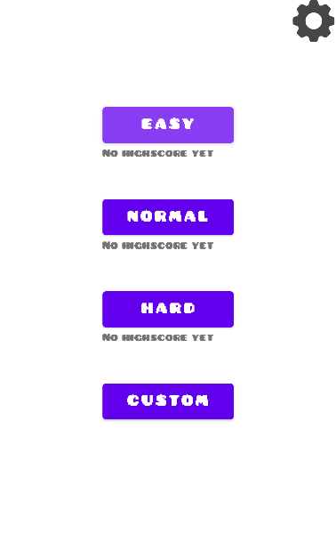
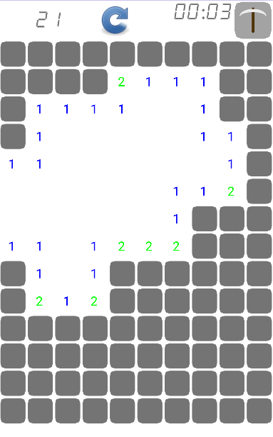
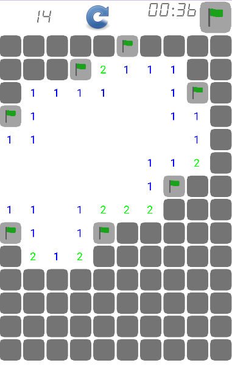
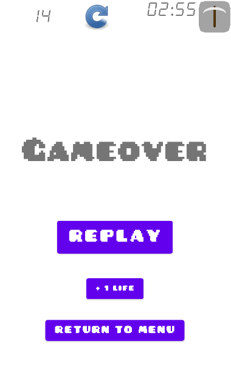

# Minesweeper Android

## Description

This is a recreating of the game Minesweeper using Kotlin. I used this project as a tool to learn Kotlin and Android dev in general.

## Summary

- [Install](#install)
- [How to use](#how-to-use)

## Install

The first thing you need to do is create a local.properties file and give it the path where it can find you SDK.
For example, It could be :
```
sdk.dir=C\:\\Users\\<UserName>\\AppData\\Local\\Android\\Sdk
```

You can then build this project by using gradle.
- If you're on linux :
```
./gradlew build
```

- And on windows :
```
gradlew.bat build
```

You can then see the apk file in the app/build/output folder

## How to use

### The Game

This is a pretty simple Minesweeper game with 3 game mode and a custom game mode where you can choose the amount of bombs you want in your grid.



Once you can then go into a game and start hitting spots on the grid to reveal them.




You can also flag spots where you think there are bombs.
To do so, click the top right icon to change the change between bomb mode and flag mode.



If you hit a bomb, you see the gameover screen:


But this is not exactly the end. In fact, you can hit the +1 Life button to get back into the game.

You win if you discover all the spaces that are not bombs.


### The Settings

The settings are not done yet.
